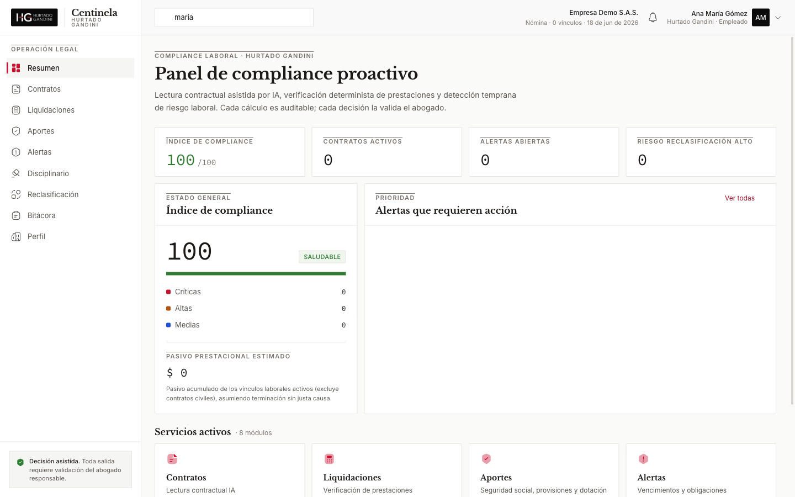
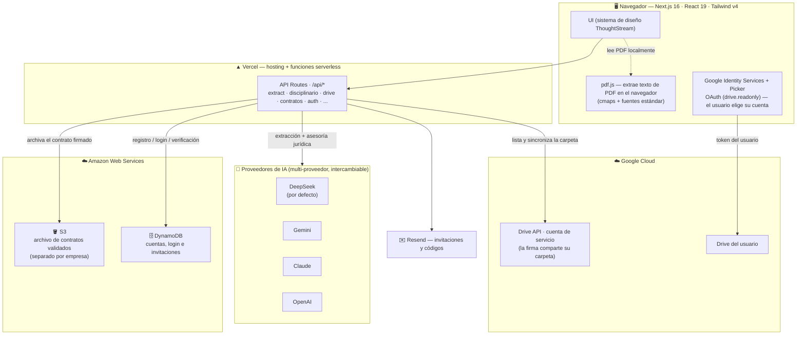
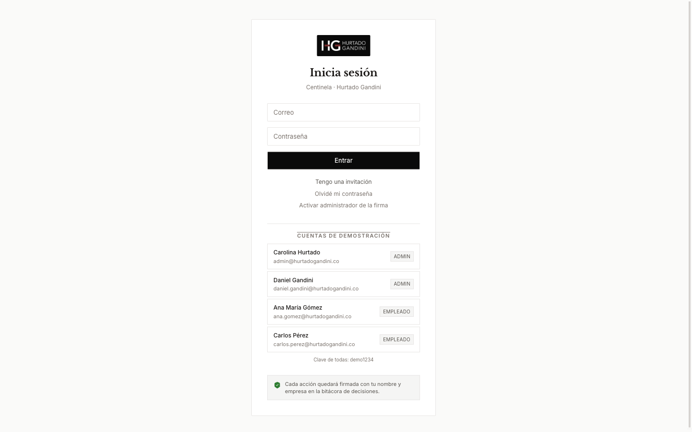
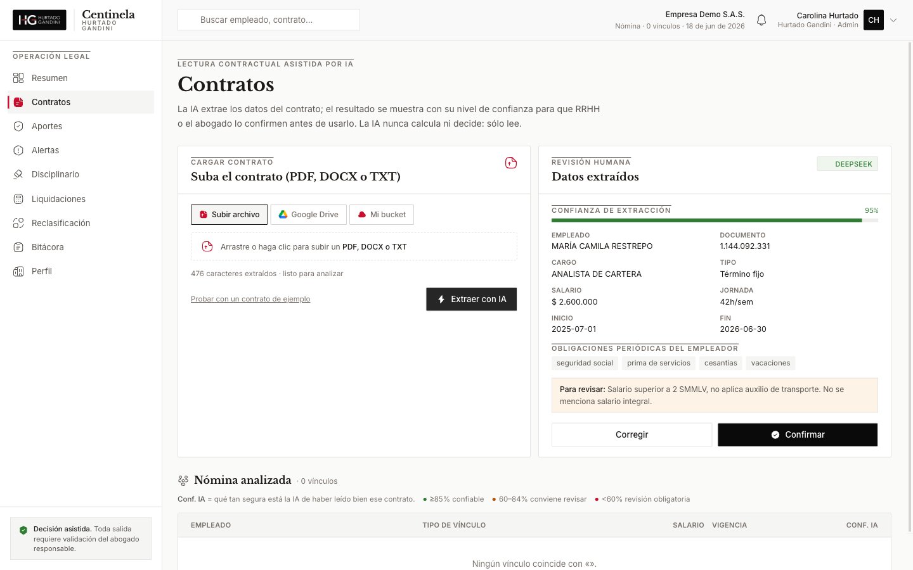
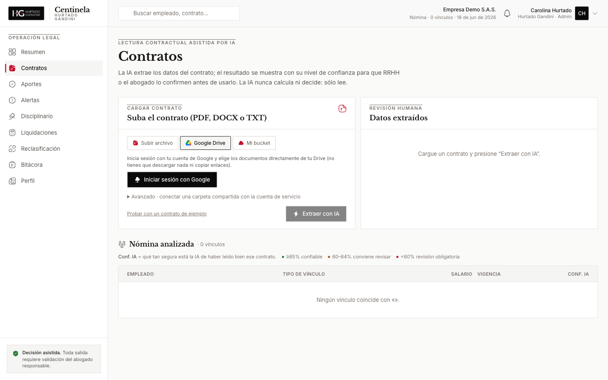
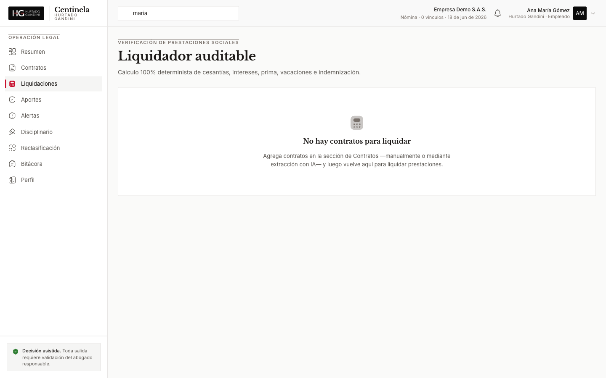
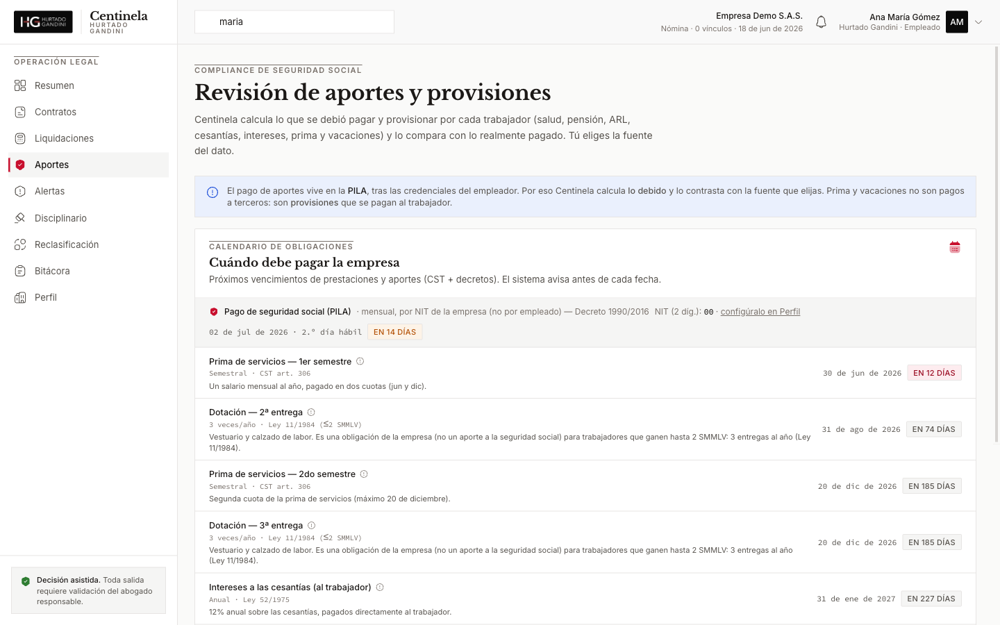
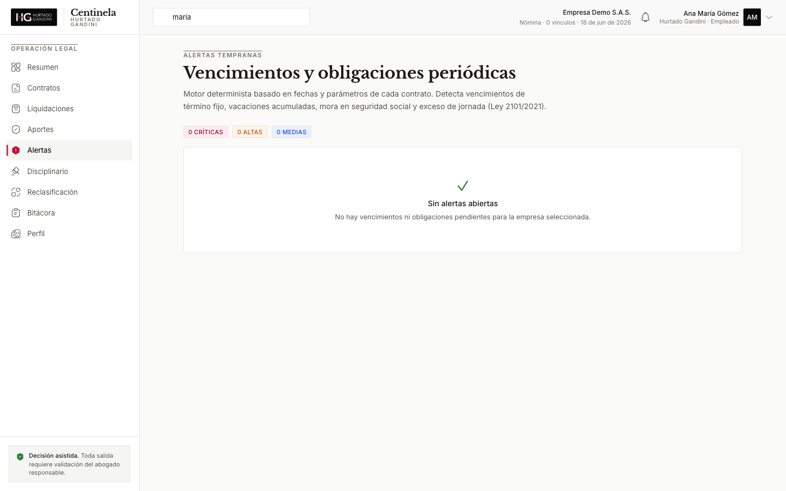
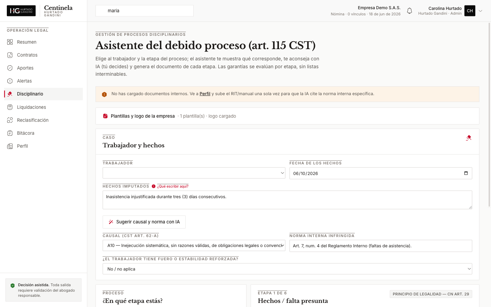
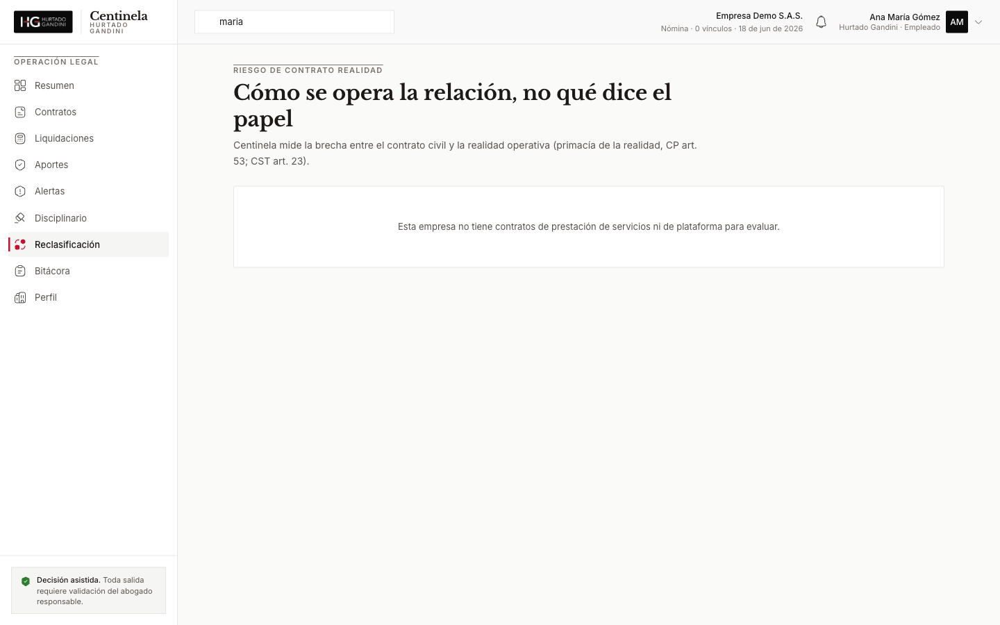

<div align="center">


# Centinela

### Compliance laboral proactivo + gestión asistida de procesos disciplinarios

**Legal Hack Icesi 2026 · Reto 4 (Laboral & Compliance) · Hurtado Gandini Abogados**

[](https://hackaton-reto4.vercel.app)


</div>

> ### La IA **lee y redacta**; un motor **determinista calcula**; el **abogado decide**.
> No dejamos que la IA haga aritmética ni invente derecho. Esa separación es el corazón del diseño — y la respuesta a la pregunta del jurado *"¿qué pasa cuando la IA se equivoca?"*.

<div align="center">

[**▶ Probar la demo en vivo**](https://hackaton-reto4.vercel.app) · Cuentas de prueba en la pantalla de inicio (clave `demo1234`)



</div>

---

## El problema

Hurtado Gandini asesora empresas con nómina propia (50–500 trabajadores). El riesgo laboral
—liquidaciones mal hechas, mora en seguridad social, vencimientos de término fijo, contratos de
prestación de servicios que son laborales en la realidad, despidos sin debido proceso— se descubre
**tarde y caro**, normalmente cuando ya hay demanda.

**Centinela** convierte esa asesoría reactiva en **compliance proactivo y auditable**: lee los
contratos con IA, calcula lo debido con un motor determinista, detecta el riesgo antes de que
venza, y asiste los procesos disciplinarios con garantías de debido proceso — siempre con
**validación obligatoria del abogado**.

---

## Cómo está construido — arquitectura de servicios

Centinela usa cada nube para lo que mejor hace: **Vercel** corre la app y las funciones; **AWS**
guarda contratos y cuentas; **Google Cloud** conecta el Drive de la firma; varios **proveedores de
IA** (intercambiables) hacen la lectura; y **Resend** envía invitaciones.



| Servicio | Para qué | Dónde |
|---|---|---|
| **Vercel** | Hosting de Next.js + funciones serverless (`/api/*`) | `next.config.ts`, todas las `route.ts` |
| **AWS S3** | Archiva el contrato validado por empresa (bucket dedicado) | `src/lib/s3.ts`, `/api/contratos/upload` |
| **AWS DynamoDB** | Cuentas de la firma, login, invitaciones, códigos | `src/lib/ddb.ts`, `/api/auth/*` |
| **Google Drive API** (cuenta de servicio) | La firma comparte su carpeta → Centinela lista y sincroniza | `src/lib/drive.ts`, `/api/drive` |
| **Google OAuth + Picker** (`drive.readonly`) | El usuario inicia sesión y elige archivos/carpeta de su Drive | `src/components/GoogleDrivePicker.tsx` |
| **DeepSeek / Gemini / Claude / OpenAI** | Lectura de contratos y asesoría disciplinaria (se elige por API key) | `src/lib/llm.ts` |
| **pdf.js** | Extracción de texto de PDF **en el navegador** | `src/lib/extract-file.ts` |
| **Resend** | Correo de invitaciones y verificación | `src/lib/email.ts` |

---

## Funcionalidades (con capturas reales)

### 🔐 Multi-tenant: una firma, varias empresas cliente
Login de la firma (admin/empleado), invitaciones, y **datos separados por empresa cliente** —
se trabaja una a la vez. Cada acción queda firmada en la bitácora.



### 📄 Contratos — lectura contractual asistida por IA
Sube un **PDF, DOCX o TXT** y la IA extrae los datos estructurados con su **nivel de confianza**,
lado a lado con el contrato, para confirmación humana. Detecta las **obligaciones periódicas del
empleador** (seguridad social, parafiscales, prima, cesantías, intereses, vacaciones, auxilio,
dotación) — editables por el revisor. Al confirmar, el contrato se archiva en **S3** y entra a la nómina.



### ☁️ Conexión con Google Drive — "Inicia sesión con Google"
La mayoría de firmas tienen **todo en Drive**. Centinela ofrece dos caminos: **iniciar sesión con
Google** y elegir archivos o **sincronizar una carpeta** con el Google Picker nativo; o conectar una
carpeta compartida con la **cuenta de servicio**. Lo que se suba a la carpeta aparece al sincronizar.



### 🧮 Liquidaciones — motor determinista y auditable
Cesantías, intereses (12%), prima, vacaciones e indemnización (art. 64) calculados **sin IA**. Cada
línea muestra su **fórmula y su norma**. Compara contra el valor pagado para detectar **sub/sobre-
liquidación**, y maneja **horas extra mes a mes** con la tarifa de recargo del año correcto (Ley 2466/2025).



### 🛡️ Aportes — seguridad social, provisiones y dotación
Calendario de obligaciones (PILA por NIT, prima, cesantías, dotación) con avisos, y verificación de
**lo debido vs. lo pagado** por trabajador (cálculo, planilla cargada o API del operador PILA).



### 🔔 Alertas — detección temprana de riesgo
Mora en seguridad social, vacaciones acumuladas, preaviso de término fijo (art. 46), exceso de
jornada (Ley 2101/2021), trabajador de plataforma (Ley 2466/2025).



### ⚖️ Disciplinario — debido proceso por etapas
Asistente de proceso disciplinario (art. 115 CST · CN art. 29 · CSJ SL1706-2024): garantías por
etapa, **sugerencia de causal y norma con IA**, y generación de la **citación / acta / decisión /
notificación**. Permite subir las **plantillas propias de la empresa** (se rellenan con el caso) y su
**logo**, para que el escrito salga listo.



### 🔄 Reclasificación — contrato realidad
Mide la brecha entre el contrato civil y la **realidad operativa** (primacía de la realidad, CP art.
53; CST art. 23), incluida la **subordinación algorítmica (Ley 2466/2025)**, y la traduce en
exposición económica. Genera un **borrador de contrato laboral** para formalizar.



---

## Por qué este enfoque (preguntas del jurado)

- **¿Por qué IA + motor determinista y no IA para todo?** La IA extrae y redacta (errores baratos de
  detectar, mostrados para revisión). Lo numérico es **determinista y auditable**: una liquidación
  "99% correcta" de una IA es una demanda. Lo jurídico lo valida un abogado.
- **¿Qué pasa cuando la IA se equivoca?** La extracción se muestra con su **confianza**, junto al
  contrato, para confirmación humana. Cada cálculo expone su **fórmula y su norma**.
- **¿Quién responde legalmente?** El abogado. Es **decisión asistida** con aprobación humana
  obligatoria — nada se presenta de forma automática. Todo queda en la **bitácora** (cadena de custodia).

---

## Stack

**Next.js 16** (App Router) · **TypeScript** · **Tailwind v4** · React 19 · Motion · iconsax-react ·
zod · pdf.js · mammoth · `@aws-sdk` (S3 + DynamoDB) · `googleapis` · Google Identity Services + Picker ·
SDKs de Anthropic / OpenAI (compatible con DeepSeek y Gemini) · Resend.
Sistema de diseño **ThoughtStream** (editorial, serif + Inter, bordes hairline) re-marcado a
**Hurtado Gandini: negro + rojo**.

---

## Ejecutar localmente

```bash
npm install
cp .env.example .env        # añade las API keys que vayas a usar (ver abajo)
npm run dev                 # http://localhost:3000
```

Sin proveedor de IA configurado, la extracción funciona en **modo demo** (heurística local), sin
romper la interfaz.

### Proveedor de IA (multi-proveedor / costo-efectivo)
Define **solo** la API key del proveedor que uses; se elige automáticamente el primero con clave, o
fuerza con `LLM_PROVIDER`.

| Proveedor | Variable | Modelo por defecto (el más barato) |
|---|---|---|
| **DeepSeek** (en uso) | `DEEPSEEK_API_KEY` | `deepseek-chat` |
| Gemini | `GEMINI_API_KEY` | `gemini-2.0-flash` |
| Claude | `ANTHROPIC_API_KEY` | `claude-haiku-4-5` |
| OpenAI | `OPENAI_API_KEY` | `gpt-4o-mini` |

### Variables de entorno (opcionales, por servicio)

| Área | Variables |
|---|---|
| IA | `LLM_PROVIDER`, `*_API_KEY`, `CENTINELA_EXTRACT_MODEL` |
| AWS S3 (archivo) | `AWS_ACCESS_KEY_ID`, `AWS_SECRET_ACCESS_KEY`, `AWS_DEFAULT_REGION` |
| AWS DynamoDB (auth) | `DDB_ACCESS_KEY_ID`, `DDB_SECRET_ACCESS_KEY`, `DDB_REGION`, `DDB_TABLE_PREFIX` |
| Google Drive (cuenta de servicio) | `GOOGLE_DRIVE_SA_EMAIL`, `GOOGLE_SERVICE_ACCOUNT_B64` |
| Google OAuth + Picker | `NEXT_PUBLIC_GOOGLE_CLIENT_ID`, `NEXT_PUBLIC_GOOGLE_API_KEY`, `NEXT_PUBLIC_GOOGLE_APP_ID` |
| Correo | `RESEND_API_KEY`, `EMAIL_FROM` |

## Desplegar (Vercel)

```bash
npx vercel --prod
```

Vercel detecta Next.js automáticamente. Define las variables de entorno en **Project → Settings →
Environment Variables** (las `NEXT_PUBLIC_*` se inyectan en *build*, así que **haz redeploy** tras
cambiarlas).

---

## Marco normativo implementado

CST (arts. 22–23, 46, 57–60, 61, 62, 64, 104–125, 127–128, 132, 160, 168, 179, 186–192, 236, 249–252,
306–307) · Ley 52/1975 · Ley 11/1984 · Ley 50/1990 · Ley 100/1993 · Ley 1010/2006 · Ley 2101/2021 ·
Ley 2466/2025 · Decreto 1072/2015 · Decreto 1990/2016 · CN art. 29 · CSJ SL1706-2024 ·
Parámetros 2026: SMMLV $1.750.905, auxilio de transporte $249.095 (Decretos 1469/1470 de 2025).

> **Datos de demostración.** Toda salida de Centinela requiere **validación del abogado responsable**.
> La herramienta es de decisión asistida; no presenta ni decide nada de forma automática.
